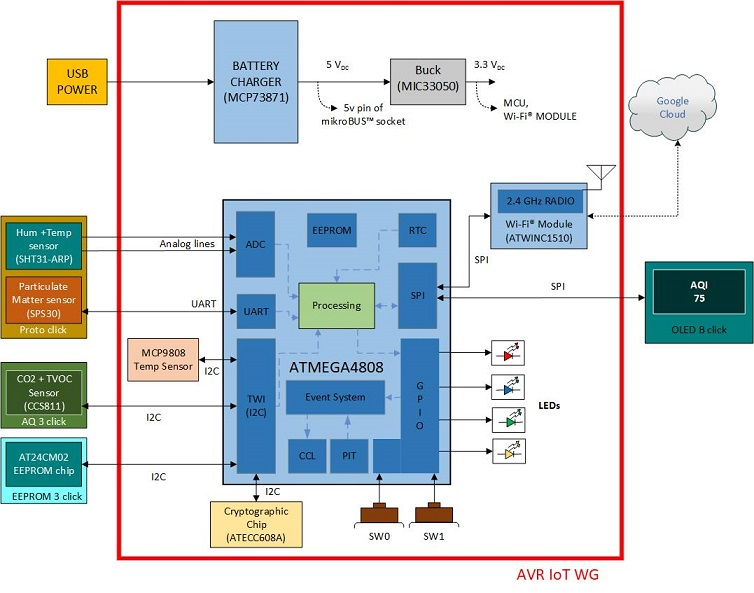

# Indoor Air Quality Monitor

## Description

This example demonstrates smart, secure and connected indoor Air Quality Monitor (AQM) using AVR IoT WG board powered by ATmega4808 MCU, secured by ATECC608A security chip and connected by WINC1510 WIFI module.

This is a document changed by Abhiram

### Note

Download/Clone the project at root of the directory to avoid build errors due to windows path length limitation.

## Related Documents/Application Notes

+ [AN3403 Indoor Air Quality Monitor: Concept and Implementation](https://www.microchip.com/DS00003403)

+ [Indoor Air Quality Monitor UG](https://www.microchip.com/DS50002966)

+ [AN3417 Indoor Air Quality Monitor: Firmware Creation Using Atmel START and MPLAB® Code Configurator (MCC)](https://www.microchip.com/DS00003417)

+ [AVR IoT Development Board User Guide](https://www.microchip.com/DS50002809)

## Introduction

In this application demonstrator, the AQM system is designed and implemented using core independent peripherals (CIPs) and intelligent analog peripherals of the ATmega4808 microcontroller featuring the 8-bit AVR® processor. Microchip’s CryptoAuthentication™ secure element (ATECC608A) and a fully certified Wi-Fi® module (ATWINC1510) are used to securely connect, the smart AQM to Google Cloud IoT Core platform.

​The application demo is realized using [AVR-IoT WG Development Board](https://www.microchip.com/DevelopmentTools/ProductDetails/AC164160) and several click boards from MikroElektronika™.

In this application, the MCU monitors humidity and temperature along with main airborne contaminants such Particulate Matter (PM2.5), Carbon dioxide (CO2) and Total Volatile Organic Components (TVOC). The MCU processes these acquired readings and calculates the Air quality Index (AQI) from the readings of PM2.5 sensor. The AQI and other acquired air quality parameters are stored on an external EEPROM and displayed on the OLED. If AQM finds internet connectivity, it uploads the AQI and other parameters to the Google Cloud. After that, the MCU enters in the sleep mode and wakes up periodically to monitor the sensors. MCU also wakes up by switch press event and displays the air quality parameters on the OLED display.

For more details refer to application note [AN3403 Indoor Air Quality Monitor: Concept and Implementation](https://www.microchip.com/DS00003403).

## Hardware Used

+ [AVR-IoT WG Development Board](https://www.microchip.com/DevelopmentTools/ProductDetails/AC164160)
  + [ATmega4808](https://www.microchip.com/wwwproducts/en/ATMEGA4808)
  + [ATWINC1510](https://www.microchip.com/wwwproducts/en/ATwinc1500)
  + [ATECC608A (pre-provisioned)](https://www.microchip.com/wwwproducts/en/ATECC608A)
  + TEMT6000 light sensor
  + [MCP9808 temperature sensor](https://www.microchip.com/wwwproducts/en/en556182)
  + [MCP73871 Battery Charger](https://www.microchip.com/wwwproducts/en/en536670)
  + 2x push buttons
  + 4x LEDs

+ [Air Quality 3 Click](https://www.mikroe.com/air-quality-3-click)
  + CCS811 TVOC and eCO2 Sensor

+ [OLED B Click](https://www.mikroe.com/oled-b-click)

+ [EEPROM3 Click](https://www.mikroe.com/eeprom-3-click)
  + [AT24CM02 2 Mbit EEPROM chip](https://www.microchip.com/wwwproducts/en/AT24CM02)

+ [SPS30 PM Sensor](https://www.sensirion.com/en/environmental-sensors/particulate-matter-sensors-pm25/)

+ [SHT31-ARP Humidity and Temperature Sensor](https://www.digikey.in/product-detail/en/sensirion-ag/SHT31-ARP-B/1649-1012-1-ND/5872293)

+ [Proto Click](https://www.mikroe.com/proto-click)

+ [Shuttle Click](https://www.mikroe.com/shuttle-click)

+ [mikroBUS Shuttles](https://www.mikroe.com/mikrobus-shuttle)

## Software Tools

* Microchip Studio for AVR® and SAM Devices [v7.0.2397 or newer](https://www.microchip.com/en-us/development-tools-tools-and-software/microchip-studio-for-avr-and-sam-devices)
* AVR GCC Compiler [v5.4.0 or newer](https://www.microchip.com/en-us/development-tools-tools-and-software/gcc-compilers-avr-and-arm)
* START [v1.7.279 or newer](https://www.microchip.com/en-us/development-tools-tools-and-software/embedded-software-center/atmel-start)

## Running the Demo

### Hardware Connection

The AVR-IOT WG board has a mikroBUS slot. Click boards are connected to the board using shuttle click, which is a mikroBUS™ socket expansion board, placed over the mikroBUS slot.

Proto click is used to interface Humidity -Temperature sensor (SHT31-ARP) and PM sensor (SPS30) with the MCU as clicks boards for these sensors are not available. Below table shows pin connections of humidity and PM sensor with mikroBUS connector of proto click.

| SHT31-ARP     | mikroBUS connector of Proto Click | mikroBUS connector of Proto Click  |SHT31-ARP|SPS30|
| :---------: |:----------:|:-----------:|:---------:|:------------:|
| PIN 1 (Humidity)	| AN 	| PWM|	|			|		
|           		| RST 	| INT	|PIN 4 (Temperature)	|		|
|          		| CS 	|RX 	|			|PIN 3 (TX)|
|          		| SCK 	| TX 	|			|PIN 2 (RX)|
|           		| MISO 	| SCL 	|			|		|
|          		| MOSI 	| SDA	|			|		|
|PIN 5 (VDD)      	| 3.3V 	| 5V 	|			|PIN 1 (5V)	|
|PIN 2,3,7,8 (VSS) 	| GND 	| GND 	|			|PIN 5 (GND)	|

### Firmware generation and Programming

1. Download the example.

2. Open the example  into Microchip Studio by clicking on the .atsln file.

3. Connect AVR IoT WG board to PC using the micro USB cable.

4. Build the application and program the device. Press Start without debugging or use  CTRL+ALT+F5 hotkeys to run the application for programming the device.

## Operation

1. Once programming is completed, “AQM” will be displayed on the OLED.

2. The LED array of the AVR-IoT WG Development Board will flash in the following order twice: Blue->Green->Yellow->Red

3. Now all the air quality parameters will start displaying one by one with predefined time (approx. 4 second). After all parameters are displayed OLED will be turned off. User can turn on the display by pressing switch SW0.

4. SW0 can also be used to display next parameter without waiting for the predefined time.

5. Following tasks are carried out according to predefined time

	+ Reading sensor parameters

	+ Sending data to the google cloud (if connection is available)

	+ Storing data in external EEPROM carries out according to predefined time.

6. Red LED will be turned on if there is any error in connection to the Wi-Fi and cloud.

7. Refer section **Wi-Fi Configuration** to visit dedicated webpage and configure Wi-Fi.

8. Check the LEDs indication for Wi-Fi connection (Blue) and cloud connection (Green). Yellow LED will flash during data upload to the google cloud.

## Wi-Fi Configuration

1. Once plugged into to the PC, the board should also appear as a Removable Storage Device on the host PC. Double click the “CURIOSITY” drive to open it. Double click on the CLICK-ME.HTM file to go to the dedicated webpage.

2. When the connection has not been established, the lower left-hand corner of the webpage will show a wireless network connection window where the user can enter the credentials for the Wi-Fi network.

3. Once these details are entered, click the Download Configuration button. This will download the WIFI.CFG (text) file on the host PC.

4. From the WIFI.CFG’s download location, drag and drop the file to the CURIOSITY drive to update the Wi-Fi credentials of the board. The Blue LED will light up to show a successful connection.

5. Once after successful connection webpage starts showing the air quality sensor data.
